# Learning Structural Dynamics with Graph Neural Network

## Introduction

**description**:

This thesis aims to formalize the equivalence between message-passing neural networks and operations on structural matrices. The proposed research  will contribute to the understanding of the underlying mechanisms of  MPNNs and help develop more efficient and interpretable MPNNs as  alternatives to structural simulators.

**purpose** : 

This thesis aims to formalize the equivalence between message passing neural networks and operations on structural matrices. Specifically, the  student will have the following objectives:

- Review the existing methods and literature (Kick-off).
- Become familiar with the PyTorch Geometric framework (already).
- Implement a first prototype, based on existing work from the literature.
- Develop a theoretical framework for formalizing the equivalence between MPNNs and structural operations.
- Formulate methods for sub-structuring/condensation schemes which exploit this framework.
- Demonstrate the method on a simple case study, exploring its advantages and limitations.

## Background

### Linear Elasticity

$$
Ku = f
$$

$$
K \overset{\text{bsr matrix}}{\leftarrow}\hat K_\text{global}
$$

$$
\hat K_{\text{global}}^{nkl} = \mathcal P_{\mathcal E}^{nhij} \hat K_{\text{local}}^{hklij}
$$

$$
\hat K^{ij}_{\text{local}}=\sum_{m}\phi_m\mathbb C(\xi_m)_{ijkl}\nabla N^j(\xi_m)_l\nabla N^i(\xi_m) = B^\top DB
$$

- $\hat K_{\text{global}} $ : non zero value of the global galerkin matrix, $K_{\text{global}}\in \mathbb R^{|\mathcal E|\times  d\times d}$
- $\hat K_{\text{local}}$ : local galerkin matrix for each element , $K_{\text{local}}\in \mathbb R^{|\mathcal C|\times h\times h\times d\times d}$ 
- $\mathcal P_{\mathcal E}$ : projection (assemble) tensor from $\hat K_{\text{local}}$ to $\hat K_{\text{global}}$, $\mathcal P_{\mathcal E} \in \mathbb R_{\text{sparse}}^{|\mathcal E|\times |\mathcal C|\times h\times h}$
- $\mathcal C$ : elements/cells 
- $h$ : number of basis for each element/cell
- $\mathcal E$ : connections for points
- $\mathcal V$ : points

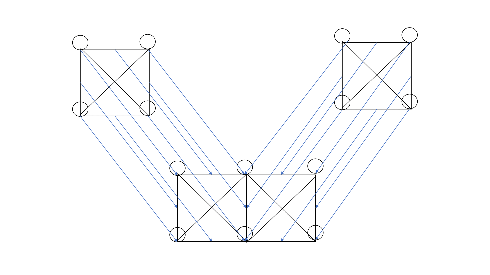

### Static Condensing

$$
\begin{bmatrix}
K_{II}&K_{IB}\\
K_{IB}^\top & K_{BB}
\end{bmatrix}
\begin{bmatrix}
u_I\\u_B
\end{bmatrix}
=
\begin{bmatrix}
f_I\\f_B
\end{bmatrix}
\to K_{II} u_I = f_I - K_{IB}u_B
$$

- $K$ is the stiffness matrix(rank-$4$ tensor for linear elasticity), $K\in \R^{(|\mathcal V|\times d)\times (|\mathcal V|\times d)}\leftrightarrow \R_{\text{sparse}}^{|\mathcal V|\times |\mathcal V|\times d\times d}$
- $K_I$ is the stiffness matrix of the inner degree of freedom, $K_I\in \R^{(|\mathcal V_i|\times d)\times(|\mathcal V_i|\times d)}\leftrightarrow \R^{|\mathcal V_i|\times |\mathcal V_i| \times d\times d}$
- $K_{IB}$ is the stiffness matrix between inner degree  of freedom and boundary degree of  freedom $K_{IB}\in \R^{(|\mathcal V_i|\times d)\times(|\mathcal V_b|\times d)}\leftrightarrow \R^{|\mathcal V_i|\times |\mathcal V_b|\times d\times d}$
- $u$ is the displacement vector(rank-$2$ tensor), $u\in\R^{(|\mathcal V|\times d)}\leftrightarrow \R^{|\mathcal V|\times  d}$
- $u_B$ is the displacement at the boundary , $u_B\in \R^{(|\mathcal V_b|\times d)}\leftrightarrow \R^{|\mathcal V_b|\times d}$
- $f$ is the applied force vector(rank-$2$ tensor), $f\in\R^{(|\mathcal V|\times d)}\leftrightarrow \R^{|\mathcal V|\times d}$
- $f_I$ is the inner nodes applied force, $f_I\in \R^{(|\mathcal V_i|\times d)}\leftrightarrow \R^{|\mathcal V_i|\times d}$  

## Method

### Static Condense Equivelant Architecture(SCEA)

*consider that boundary condition if homogenous(applied to all $d$ dimension)*

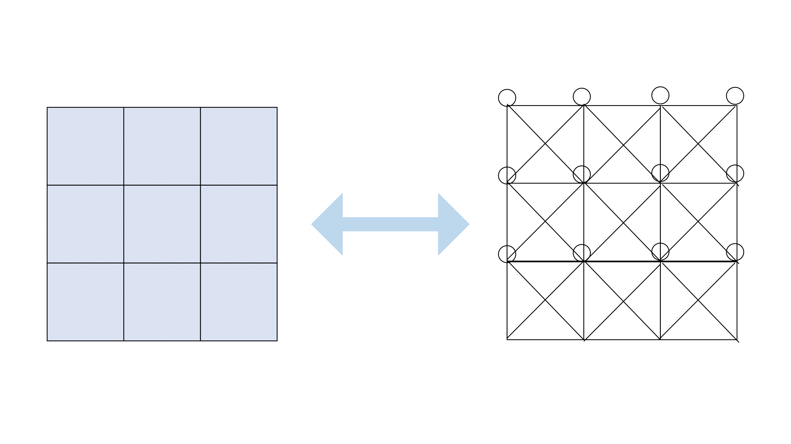
$$
\begin{aligned}
\text{GNN}_{\theta_1}(A_{II},f_I',x) &\approx K_{II}^{-1}(x_I)(f)
\\
\text{B-GNN}_{\theta_2}(A_{IB},u_B,x_B)&\approx -K_{IB}u_B
\end{aligned}
$$

$$
u_I = K_{II}^{-1}(f_I-K_{IB}u_B)
\\
\downarrow
\\
u_I = \text{GNN}_{\theta_1}(A_{II},f_I+\text{B-GNN}_{\theta_2}(A_{BI},u_B), x_I)
$$

```python
def b_gnn(x_src, edge_index, num_dst_nodes)

	num_src_nodes = x_src.size(0)
    
    x_src = self.mlp1(x_src)
    
    adj = torch.sparse_coo_tensor(
        edge_index,
        torch.ones(edge_index.size(1)),
        (num_dst_nodes, num_src_nodes),
        dtype=x_src.dtype,
        device=x_src.device
    )

    x_dst = adj @ x_src

    x_dst = self.mlp2(x_dst)
    
    return x_dst
```

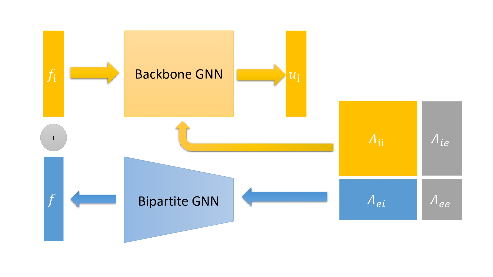

### Galerkin Equivelant Architecture (GEA)

**Local Pseudo Linear GEA**
$$
\text{MLP}_\theta(x)\approx \hat K_{\text{local}}
$$

$$
K = \text{bsr\_matrix}(\mathcal P_{\mathcal E} \hat K_{\text{local}})
\\
\downarrow
\\
K = \text{bsr\_matrix}(\mathcal P_{\mathcal E} \text{MLP}_\theta(x))
$$


**Local Pseudo Bilinear GEA**
$$
\begin{aligned}
\text{MLP}_{\theta_1}(x)\approx B
\\
\theta_{2,ij} +\theta_{2,ji} - \theta_{2,ii} \approx D
\end{aligned}
$$

$$
K = \text{bsr\_matrix}(\mathcal P_{\mathcal E} B^\top DB)
\\
\downarrow
\\
K = \text{bsr\_matrix}(\mathcal P_{\mathcal E} \text{MLP}_{\theta_1}(x)^\top (\theta_2 +\theta_{2}^\top - \text{diag}(\theta) )\text{MLP}_{\theta_1}(x))
$$


**Global GEA**
$$
\text{Edge-GNN}(\tilde x) \approx K
$$

```python
def edge_gnn_conv(x, edge_index):
     x_src = x[edge_index[0]]
     x_dst = x[edge_index[1]]
     x_edge = torch.cat([x_src, x_dst], -1)
     edge_weight = self.mlp(x_edge).squeeze() # [n_edge, 1]
     f = spmm(edge_index, edge_weight, x.shape[0], x.shape[0], u[:, None])[:, 0]
     return f
```


## Experiments


### Static Condense Equivelant Architecture(SCEA)

**dataset**

the bottom are fixed in $x$ and $y$ direction

the top are applied constant force downward.

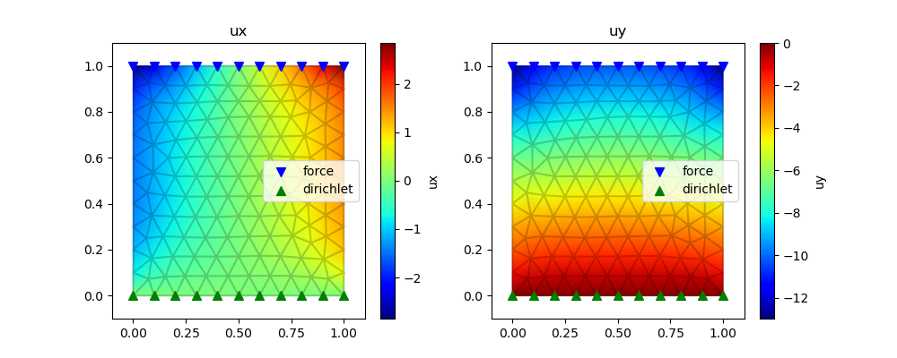

**training**
$$
\mathcal L = \mathcal L_{\text{data}} + \mathcal \lambda L_{\text{physical}}
\\
\mathcal L_{\text{data}} = \Vert u_\theta - u\Vert
\\
\mathcal L_{\text{physical}} = \Vert Ku_\theta -f\Vert
$$


- $\lambda = 0.01$ 

**loss GAT**

train ratio = 0.3

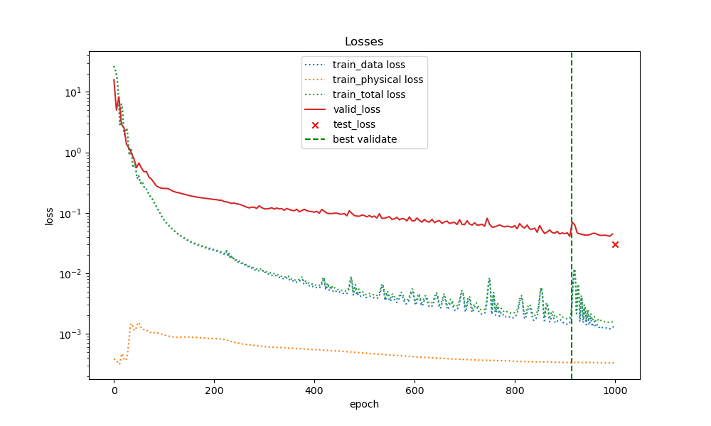

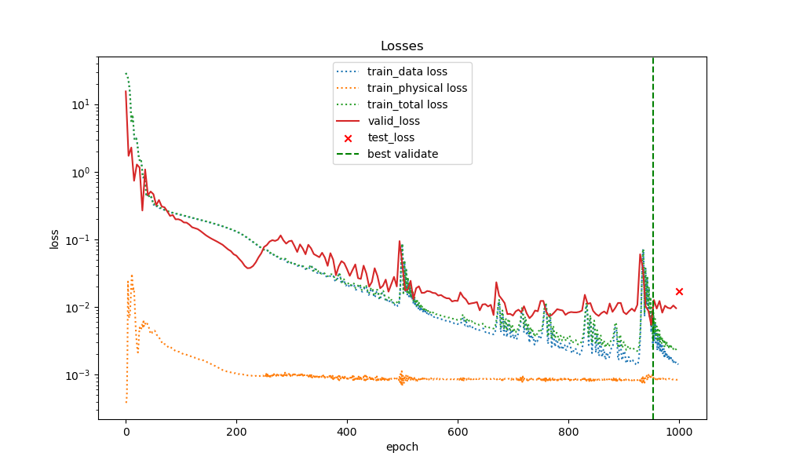

**loss SIGN**

train ratio = 0.3

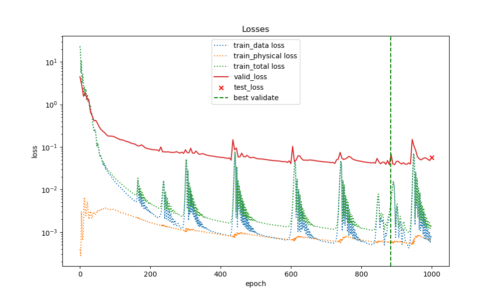

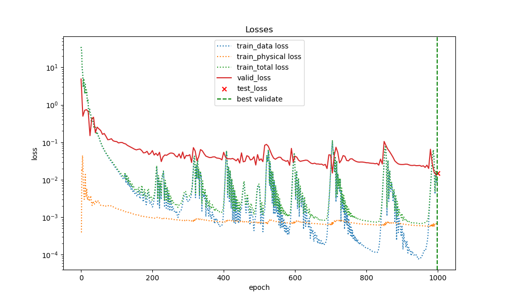

**scale-invariant test**


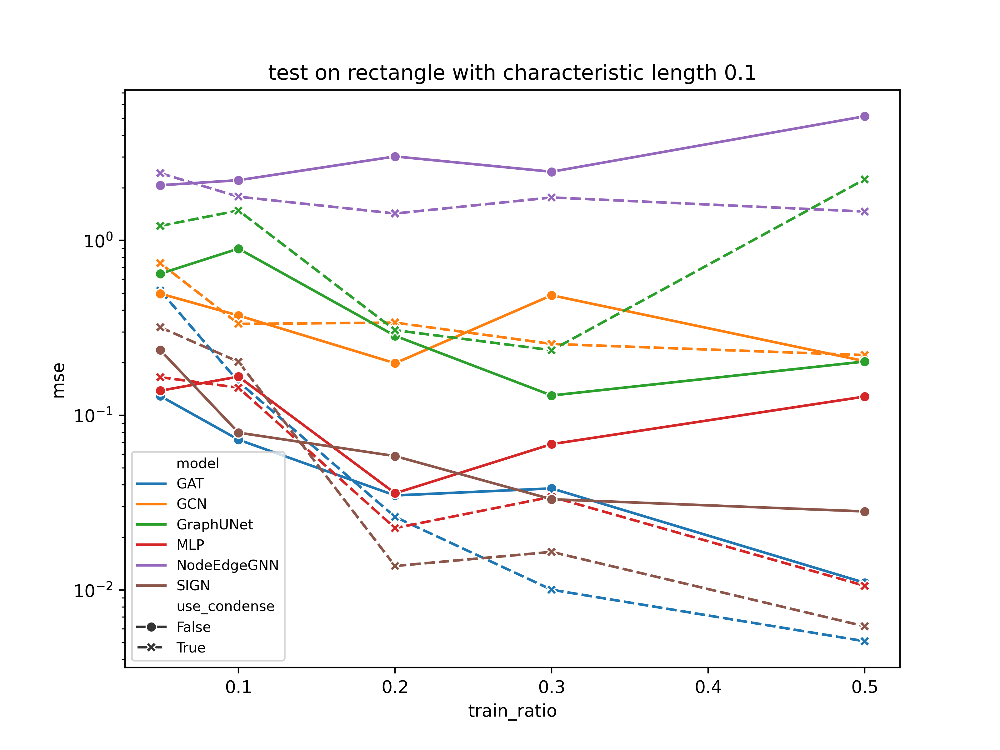

**scale-variant test**

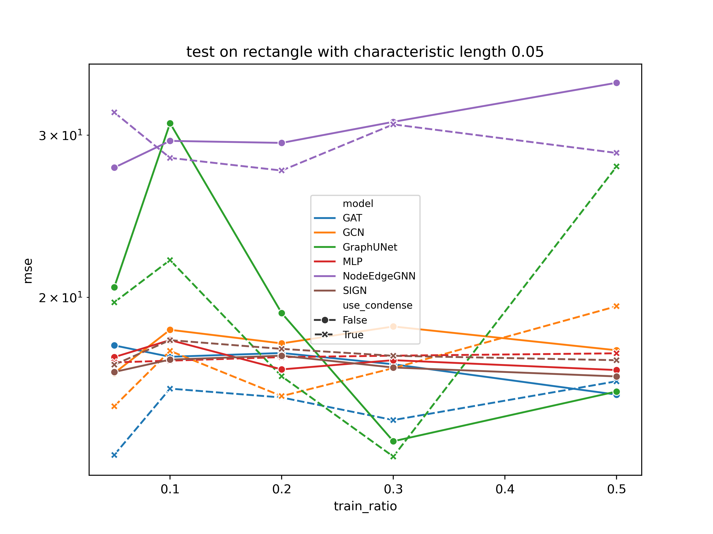

### Galerkin Equivelant Architecture (GEA)

**purpose** : We want to develop a message passing neural network similar to the Finite Element Method $K,u\to f$, therefore, we want to learn the forward process $\text{MPNN}_\theta(x,u)\approx Ku$

**training**
$$
\mathcal L = \Vert  K_\theta u - f\Vert
$$
with `torch.optim.lr_scheduler.CosineAnnealingLR`

**Local Pesudo Linear GEA**

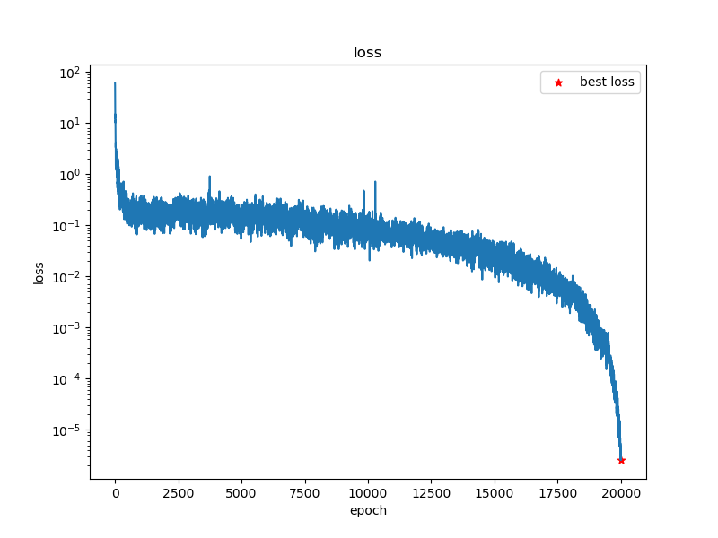

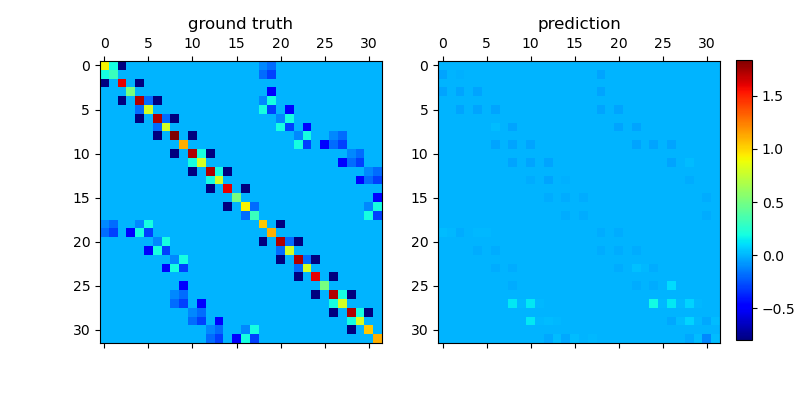

**Local Pesudo Bilinear GEA**

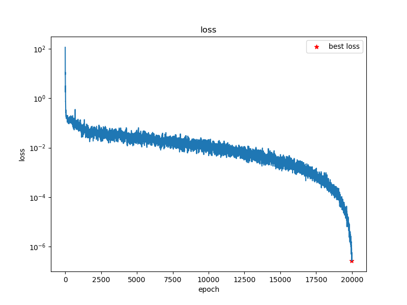

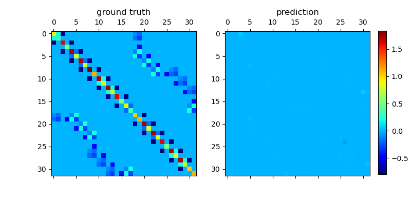

**Global GEA without Positional Encoding**

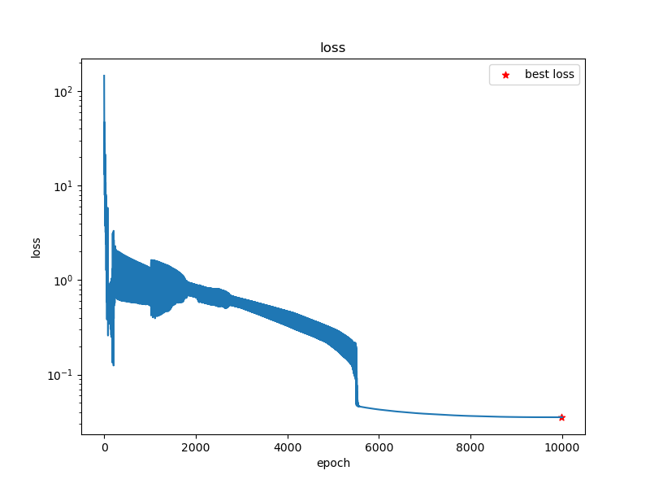


**Global GEA with Positonal Encoding**

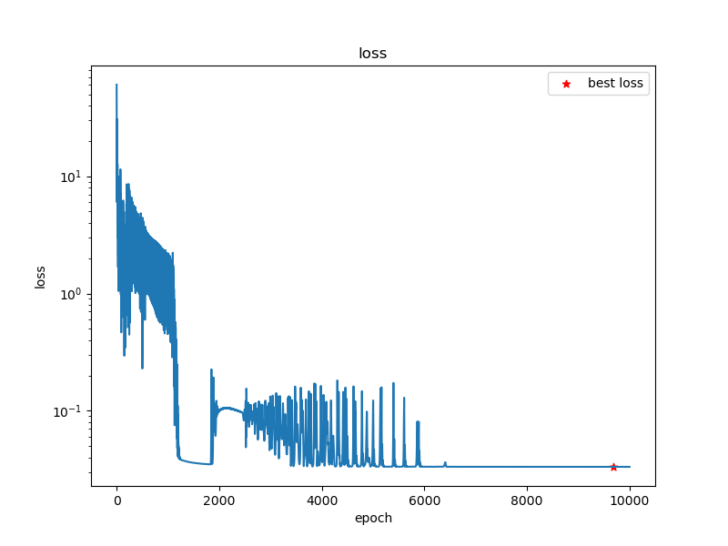


## Conclusion

### SCEA

- with Static Condensing Equivelant Architecture, the model is much more robust in the learning process. The discrepancy between the $\mathcal L_{\text{valid}}$ an $\mathcal L_{\text{train}}$ is much smaller than the naive architecture. 
- The SCEA-GAT outperform other models when there is sufficient observation data
-  When the observation data are insufficient ($<10\%$), there is no extinguishable difference in performance for all models.
- The scale-variant test shows that GraphUNet is incredibaly good when about $30\%$ of data are available.

### GEA

- Galerkin Equivelant Architecture is hard to learn the matrix since it's linear combination. Low loss doesn't mean good accuracy $\underset{\theta}{\text{argmin}}\Vert K_\theta u -f\Vert\neq \underset{\theta}{\text{argmin}}\Vert K_\theta - K\Vert$
- positional encoding doesn't help a lot in the training process.


## Further work

### SCEA

- [x] Review the existing methods and literature (Kick-off).
- [x] Implement a first prototype, based on existing work from the literature.
- [x] Develop a theoretical framework for formalizing the equivalence between MPNNs and structural operations.
- [x] Formulate methods for sub-structuring/condensation schemes which exploit this framework.
- [x] Demonstrate the method on a simple case study, exploring its advantages and limitations.
- [ ] Tune the trainig parameters to make the loss lower, currently the loss is too large.
- [ ] Test for different boundary condition and same mesh
- [ ] Plot the best prediction result with the ground truth

### GEA

- [ ] Review the existing methods and literature

- [x] Develop multi theoretical framework for formalizing the equivalence between MPNNs and forward Galerkin.

- [x] Formulate methods for forward problem 

- [ ] Try to achieve a good result from these methods 

  